  

# User Manual (English)

> This manual introduces the functions and tips for the NLA-Stride Blender add-on, as well as answers to some common known issues.

---

## 📘 Contents

1. [Quick Start](#-quick-start)  
2. [Version Highlights](#-version-highlights)
3. [Feature Overview](#-feature-overview)      
4. [FAQ](#-faq) 
5. [Other Tips](#-other-tips) 
6. [Technical Reference](#-technical-reference)

---

## 🚀 Quick Start

### 1. Add-on Installation

1. Use the official Blender installation steps ( **[General Installation Guide](https://docs.blender.org/manual/en/latest/editors/preferences/addons.html)** )

2. After installation, you can find **NLA Stride Tool** in the Blender 3D Viewport **Sidebar → Animation** tab. 
 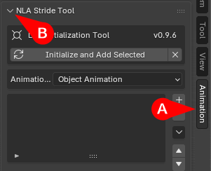

---

### 2. Select Objects with Animation  
<a href="images/img_1002.png">
  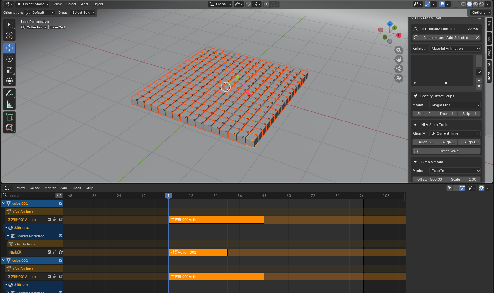
</a>  

Select one or more objects containing animation data. If using standard animations instead of NLA strips, please refer to the "Batch Push to NLA" instructions.

---

### 3. Add to List

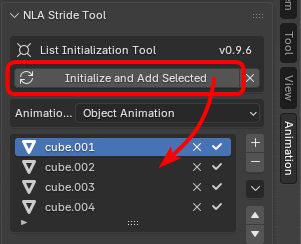

⚠️ Note: The add-on operates based on the list, regardless of the currently selected objects in the scene.

---

### 4. NLA Alignment / Offset Operations

<a href="images/img_1004.png">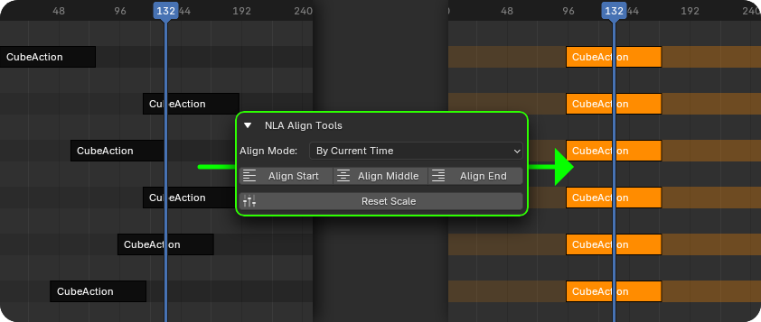</a>  

<a href="images/img_1005.png">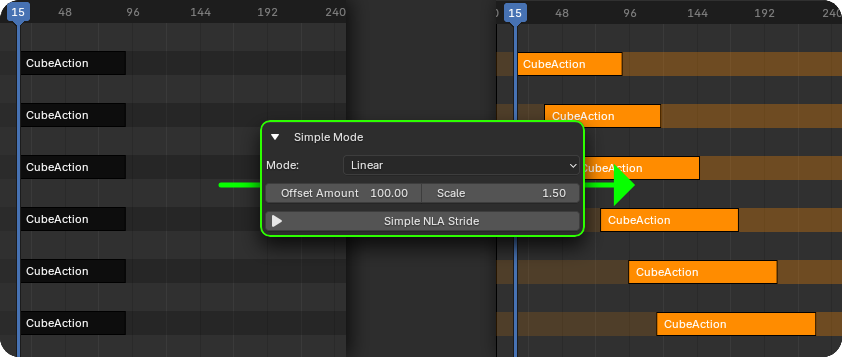</a>  

<a href="images/img_1006.png">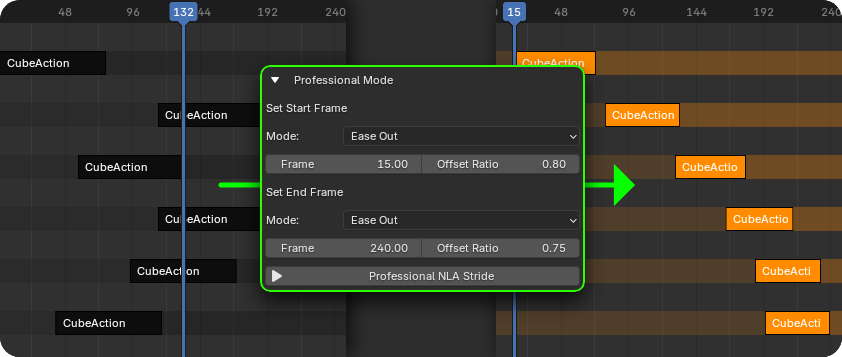</a>  

The above diagrams illustrate NLA alignment and offset functions.

---

### 5. Enjoy the Animation

<a href="images/DEMO_01.mp4">
  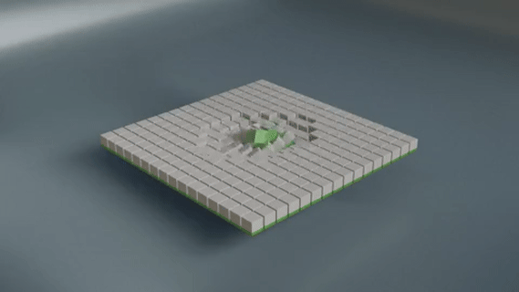
</a>  

<a href="images/DEMO_02.mp4">
  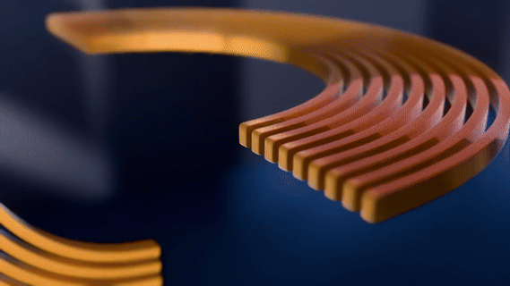
</a>  

<a href="images/DEM3_03.mp4">
  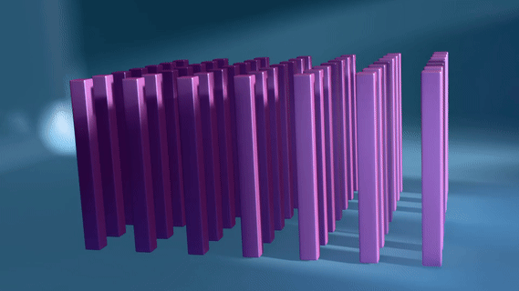
</a>  

<a href="images/DEM3_04.mp4">
  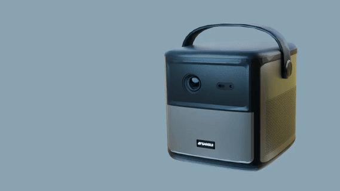
</a>  

Example model thanks to [SANSUI Taiwan](https://www.sansuitw.com/?gad_source=1&gad_campaignid=23085773952&gbraid=0AAAAAoXC59ENhboAZDO-y0zK4yQpidtXM&gclid=CjwKCAiAybfLBhAjEiwAI0mBBscjnZOEYBBY127EypNMfnL1h_Vqm_HACczeJBOqMK-euDJFPb1iAxoC7rkQAvD_BwE) for providing.

---
## 🌟 Version Highlights
#### v1.0.0 Highlights
- List Export / Import / Append  
  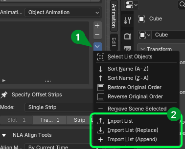  
  1. Added three functions within list operations.
  2. Export and Import use *.json format.
  3. Append will add items to the end of the list.
  4. If names are duplicated, the first one encountered will take priority.
#### v0.9.8 Highlights  
- Initial public release  
---
## 🧰 Feature Overview

#### 1. List Initialization Tool 

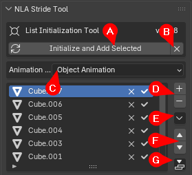

- A : Initialize and Add Selected    
  Clears the list data and then adds currently selected objects from the scene.
   
- B : Clear List  
  Clears all data within the list.
   
- C : Animation Source  
    Currently supports three types:
    - Object Animation  
    - Shape Key Animation  
    - Material Animation
   
- D : Add / Remove Objects from List  
  Adding **will not** clear existing items; objects are added to the end **in selection order**. Removing here differs from 1-J.
   

- E : List Operations (Dropdown Menu)  
  See [1-1 List Operations](#1-1-list-operations) for details.
   

- F : Move Selected Item Up / Down  
  Manually adjust sorting. If order is adjusted, the result is defined as the **"Original Order"**.
   

- G : Push to NLA (Dropdown Menu)  
  Converts animations to NLA strips only for objects in the list.
     
  
-  PS. [3. Legend for List Icons](#3-legend-for-list-icons)

#### 1-1. List Operations

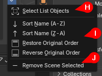

- H : Initialize and Add Selected   
  Clears the list data and adds the currently selected objects.
   

- I : Sorting Modes    
  Includes **Original Order** (which the add-on tracks) and three other sorting methods.
   

- J : Remove Scene Selected   
  Removes objects currently selected in the scene from the list.
   

#### 2. Specify Offset Strips

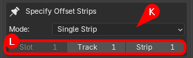

- K : Strip Mode  
  - Single Strip: Targets only one specific strip.
  - Single Track: Treats all strips on a track as a single unit (maintains relative positions).
  - All Tracks: All tracks of the object change together (maintains relative positions).
   

- L : Slot/Track/Strip Positioning  
  - Slot: Material mode only, calculated **top to bottom** in the interface.
  - Track: Calculated **bottom to top** in the NLA Editor.
  - Strip: Calculated **left to right** in the NLA Editor.
   

  **!! Note: If the target is not correctly located, NLA Stride cannot function.**

#### 3. NLA Align Tools (Initialize Values)
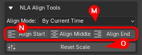

- M : Align Mode Target  
  - By Max Start Frame: Aligns to the **start** of the **latest** starting strip in the list.
  - By Min Start Frame: Aligns to the **start** of the **earliest** starting strip in the list (Common).
  - By Max End Frame: Aligns to the **end** of the **latest** ending strip in the list (Common).
  - By Min End Frame: Aligns to the **end** of the **earliest** ending strip in the list.
  - By Current Time: Aligns to the current playhead position (Most Common).
   

- N : Align Position  
  - Align Start: Aligns the left side to the target.
  - Align Middle: Aligns the center to the target.
  - Align End: Aligns the right side to the target.
   

- O : Reset Scale  
  Resets the scale of all specified NLA strips in the list to 1.
   

#### 4. Simple Mode

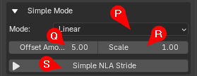  
- P : Falloff Mode [(Detailed Description)](#2-offset-description)  
  Four calculation formulas: 1. Linear / 2. Ease In / 3. Ease Out / 4. Ease In Out.
   

- Q : Offset Amount (Unit: **Frames**)  
  Not the equidistant gap between strips, but the total difference between the first and last object in the list (allows negative values).
   

- R : Scale  
  Not the equidistant scaling, but the scaling difference between the first and last object (0 ~ 1).
   

- S : Execute Simple NLA Stride (Values accumulate if pressed repeatedly).
   

#### 5. Professional Mode
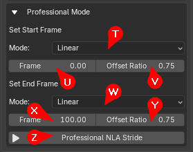  
  **>> The core feature: define start and end points, and strips will automatically offset and scale. <<**

- T : Pro Start Falloff [(Detailed Description)](#2-offset-description)  
  Offset calculation formula: Linear, Ease In, Ease Out, or Ease In Out.
   

- U : Set Start Frame  
  Sets the global **Start** time for the entire animation sequence in the list.
   

- V : Offset Ratio  
  The offset amount multiplied by the Falloff mode (T), used to automate start frame positioning.
   

- W : Pro End Falloff [(Detailed Description)](#2-offset-description)    
  Offset calculation formula: Linear, Ease In, Ease Out, or Ease In Out.
   

- X : Set End Frame    
  Sets the global **End** time for the entire animation sequence in the list.
   

- Y : Offset Ratio    
  Difference between the first and last object's end frames (allows negative values).
   

- Z : Execute Professional NLA Stride (Values **do not** accumulate).
   

---

## ❓ FAQ

#### 1. ⚠️ Be careful with "Instanced Data" details

This add-on targets the NLA Strips themselves for offset and alignment,  
it **does not** automatically handle Blender's "Instanced Data" relationships.

#### What is Instanced Data?

When **multiple objects share the same data block**, that data is "Instanced".

- For example:  
  - Two objects sharing the same Material.  
  - Sharing the same Action, Mesh, or other data blocks.  

In the NLA Editor, they look like two independent strips, but they **point to the same data behind the scenes**.
As a result, when using **NLA Stride to offset**, the add-on moves the strips, but since they influence the same underlying data, the **expected offset effect will not be achieved**.

#### ✅ Solution (Follow the screenshot below)

> 💡 **Key Practice: Make data independent before offsetting**

Steps:

1. Select the objects in the 3D Viewport.  
2. Go to **Object → Relations**.  
3. Click **Make Single User**.  
4. Select the data types that need to be independent.
5. Once data is independent, use **NLA Stride** to offset.  

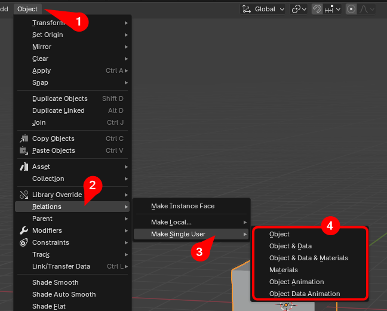

> Once data is independent, each object has its own "Truly Unique NLA Data".
> NLA Stride will then **offset NLA strips normally and predictably**.
---

#### 2. ⚠️ Batch Push to NLA

This add-on works specifically on NLA Strips. Animation data that hasn't been pushed to NLA will not be affected.

#### ✅ Solution: Batch Conversion Tool

The add-on provides a tool to push animations to NLA for all objects **in the list** (Green arrow below). Note: this targets the list, not just 3D selection.

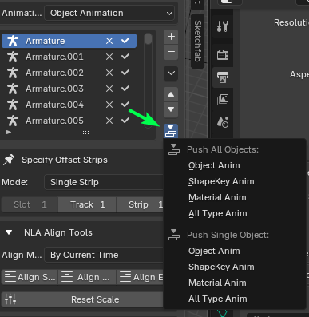

---

## 📖 Other Tips

#### 1. Alignment and Offset Strategy

- You can press **Alt A** in the 3D Viewport to deselect all, then use the **Select List Objects** function to verify exactly which objects are in your list.  
 

- Because **Order** is crucial (it directly affects the offset result), try to use names to determine order. If you have many objects, process them in batches.  
 

- If things get messy, use the Alignment tool to reset everything to a unified starting point.  
 

- Since offsetting becomes easy, focus on creating one **perfect dynamic movement** first.  
 

- If your animation involves **Location**, duplicates might snap back to the same position. Use **Ctrl A** to apply transformations to the **Delta Transform** data.  
   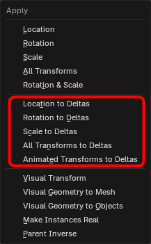  

---

#### 2. Offset Description
- Linear Falloff Mode:  
  - Simple Mode:   
  <a href="images/img_4002.png">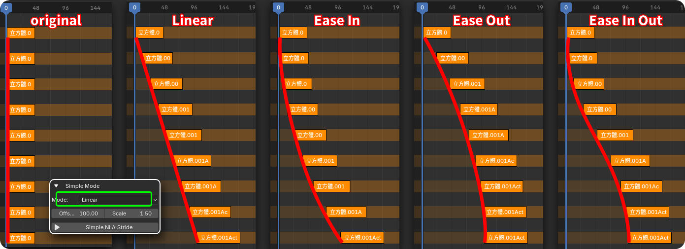</a>  
  Simple mode calculates based on the original state (left). For example: Offset 100, Scale 1.5. The last strip's start and length will match the settings, but intermediate strips vary based on the Falloff mode.

    ---
  - Professional Mode:    
  <a href="images/img_4003.png">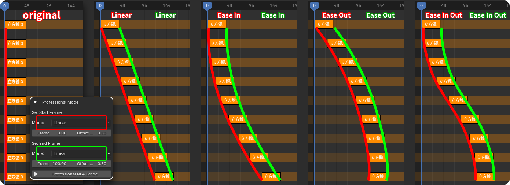</a>  
  Unlike Simple mode, Professional mode controls both the Head and Tail, allowing separate Falloff modes for each.  
  
    ---
  - **Note**:   
  <a href="images/img_4004.png">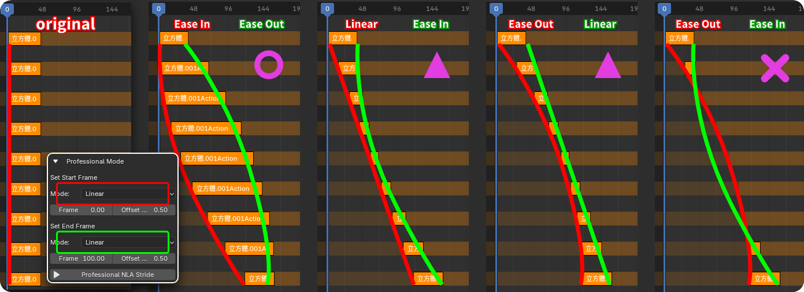</a>  
  If the Start and End Falloff modes are **different**, watch out for strips becoming too short or disappearing.
---

#### 3. Legend for List Icons

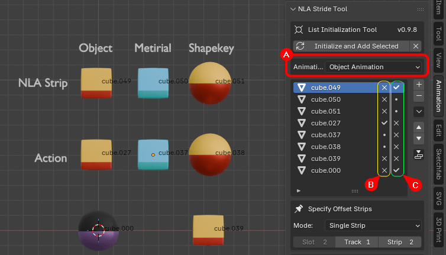

Icon A: Animation Source Mode
Icon B: Action represents general animation data (Not yet in NLA)
Icon C: Available NLA Data

- Symbols in B and C change based on Source Mode (A):
  - ✔ : Contains **Correct** data matching Mode A.
  - ・: Contains data, but **NOT** matching Mode A.
  - ✕ : No data found.

Data in the example:
| Item | Object Anim | Material Anim | Shape Key Anim |
|------|------|------|--------|
| **NLA Strip** | cube.049 | cube.050 | cube.051 | 
| **Active Action** | cube.027 | cube.037 | cube.038 | 

- Others: cube.000 (Has NLA for all 3 types) / cube.039 (No animation data at all)

---

## 🔧 Technical Reference

  [Blender NLA Official Manual](https://docs.blender.org/manual/en/latest/editors/nla/index.html)

  [Blender API Official Manual](https://docs.blender.org/api/current/bpy.ops.nla.html)

  

## 📘 Contents

1. [Quick Start](#-quick-start) 
2. [Version Highlights](#-version-highlights) 
3. [Feature Overview](#-feature-overview)      
4. [FAQ](#-faq) 
5. [Other Tips](#-other-tips) 
6. [Technical Reference](#-technical-reference)